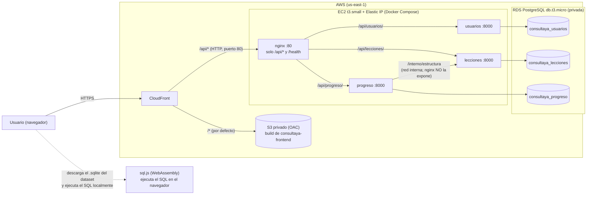
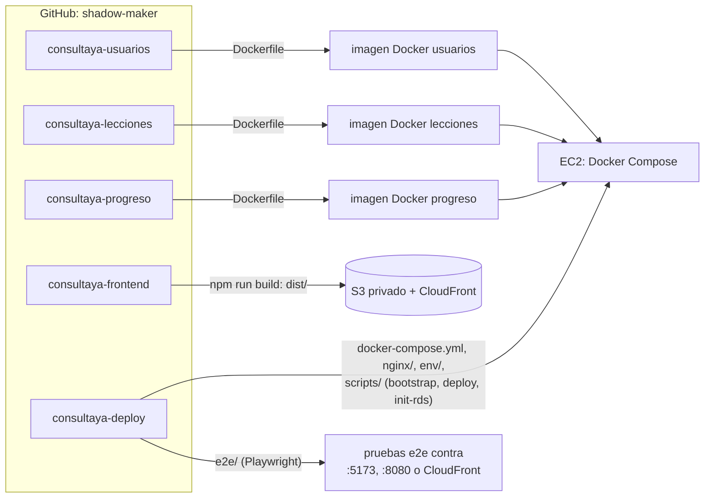
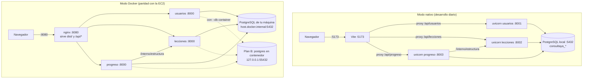

# consultaya-deploy

Despliegue de **ConsultaYa**, una plataforma web para aprender SQL practicando, en español, con datos de negocios latinoamericanos. Este repo reúne todo lo necesario para correr el sistema completo y llevar el backend a AWS: `docker-compose`, nginx, scripts locales (macOS, Linux y Windows) y de AWS (EC2/RDS), y las pruebas e2e con Playwright.

## Cómo encaja con los demás repos

ConsultaYa se reparte en 5 repos de GitHub (cuenta `shadow-maker`). **Se clonan como carpetas hermanas**: los scripts y el compose de este repo asumen `../consultaya-<repo>`.

| Repo | Qué es | Puerto local |
|---|---|---|
| [consultaya-usuarios](https://github.com/shadow-maker/consultaya-usuarios) | Microservicio de registro, login, JWT y perfil (FastAPI) | 8001 |
| [consultaya-lecciones](https://github.com/shadow-maker/consultaya-lecciones) | Microservicio de módulos, lecciones, ejercicios y datasets (+ contenido y seed) | 8002 |
| [consultaya-progreso](https://github.com/shadow-maker/consultaya-progreso) | Microservicio de avance, ruta y resumen | 8003 |
| [consultaya-frontend](https://github.com/shadow-maker/consultaya-frontend) | SPA React + Vite; el SQL se ejecuta en el navegador con sql.js | 5173 |
| [consultaya-deploy](https://github.com/shadow-maker/consultaya-deploy) | **Este repo**: compose, nginx, scripts, e2e y guía de despliegue | 8080 (nginx local) |

Documentación de este repo: [arquitectura](docs/arquitectura.md) · [desarrollo local](docs/desarrollo-local.md) · [despliegue en AWS](docs/despliegue-aws.md) · [pruebas e2e](docs/e2e.md).

## Primeros pasos para el equipo

### 1. Requisitos

| Herramienta | macOS | Linux | Windows 10/11 |
|---|---|---|---|
| **Git** | `xcode-select --install` o `brew install git` | `sudo apt install git` (o el gestor de tu distro) | [git-scm.com](https://git-scm.com/download/win) o `winget install Git.Git` |
| **uv** (Python 3.12 lo descarga uv solo) | `brew install uv` o `curl -LsSf https://astral.sh/uv/install.sh \| sh` | `curl -LsSf https://astral.sh/uv/install.sh \| sh` | `powershell -c "irm https://astral.sh/uv/install.ps1 \| iex"` o `winget install astral-sh.uv` |
| **Node.js ≥ 20** (con npm) | `brew install node` o [nodejs.org](https://nodejs.org) | [nodejs.org](https://nodejs.org) o `nvm` | `winget install OpenJS.NodeJS.LTS` |
| **PostgreSQL** (servidor y cliente `psql`) | [Postgres.app](https://postgresapp.com) o `brew install postgresql@17` | `sudo apt install postgresql` (o el paquete de tu distro) | [instalador oficial](https://www.postgresql.org/download/windows/) (marca "Command Line Tools") |
| **Docker Desktop** (opcional: solo para el modo Docker) | [docker.com](https://www.docker.com/products/docker-desktop/) | Docker Engine + plugin compose | [docker.com](https://www.docker.com/products/docker-desktop/) (con WSL 2) |

Comprueba: `git --version`, `uv --version`, `node -v`, `psql --version` (si `psql` no aparece, agrega la carpeta `bin` de PostgreSQL al `PATH`; en Windows suele ser `C:\Program Files\PostgreSQL\<versión>\bin`). En Windows usa **PowerShell** (5.1 o 7): `dev-up.ps1` y compañía.

### 2. Clonar los 5 repos como carpetas hermanas

```bash
mkdir consultaya && cd consultaya
for r in deploy usuarios lecciones progreso frontend; do
  git clone https://github.com/shadow-maker/consultaya-$r.git
done
```

En PowerShell: `foreach ($r in 'deploy','usuarios','lecciones','progreso','frontend') { git clone "https://github.com/shadow-maker/consultaya-$r.git" }`. Los repos son privados: necesitas acceso a la organización y credenciales de GitHub configuradas.

### 3. Crear el `.env` de deploy

Es la única configuración que toca cada persona (Git la ignora):

```bash
cd consultaya-deploy
cp .env.example .env              # PowerShell: Copy-Item .env.example .env
```

Edita `.env` con los datos de **tu** PostgreSQL local: `DB_HOST`, `DB_PORT`, `DB_USER`, `DB_PASSWORD` (vacía si tu usuario no usa contraseña) y `JWT_SECRET` (puedes dejar el valor de desarrollo). Los scripts generan a partir de ahí los `.env` de los 3 servicios. Detalle en [docs/desarrollo-local.md](docs/desarrollo-local.md#configuración-consultaya-deployenv).

### 4. Dependencias del frontend

```bash
cd ../consultaya-frontend && npm install && cd ../consultaya-deploy
```

(Las dependencias de Python las instala `dev-up` con `uv sync`.)

### 5. Levantar todo

| | macOS / Linux | Windows (PowerShell) |
|---|---|---|
| Segundo plano | `scripts/dev-up.sh` | `scripts\dev-up.ps1` |
| Atado a la terminal (`Ctrl+C` lo detiene todo) | `scripts/dev-up.sh --foreground` | `scripts\dev-up.ps1 -Foreground` |
| Estado | `scripts/dev-status.sh` | `scripts\dev-status.ps1` |
| Detener (segundo plano) | `scripts/dev-down.sh` | `scripts\dev-down.ps1` |

`dev-up` crea las bases `consultaya_*` que falten, genera los `.env` de los servicios si no existen, instala dependencias, migra, siembra los datos y arranca los 3 servicios y Vite. Opciones: `--no-seed`, `--no-front`, `--help` (en PowerShell: `-NoSeed`, `-NoFront`, `-Help`). Si PowerShell bloquea los scripts: `Set-ExecutionPolicy -Scope CurrentUser RemoteSigned` o ejecuta `powershell -ExecutionPolicy Bypass -File scripts\dev-up.ps1`.

### 6. URLs y cuentas demo

- Aplicación: **http://localhost:5173**
- APIs (Swagger): http://localhost:8001/api/usuarios/docs · http://localhost:8002/api/lecciones/docs · http://localhost:8003/api/progreso/docs
- Cuenta con avance: `demo@consultaya.pe` / `demo1234` · cuenta sin avance: `nuevo@consultaya.pe` / `nuevo1234`

### 7. Probar

```bash
cd e2e && npm install && npx playwright install chromium && npm test    # 12 escenarios contra :5173
```

Más en [docs/e2e.md](docs/e2e.md). Los tests de cada servicio: `uv run pytest` dentro de su repo; los del frontend: `npm test`.

### Problemas comunes

| Síntoma | Qué hacer |
|---|---|
| `dev-up` dice que no existe `.env` | Copia `.env.example` a `.env` y ajusta tu usuario y contraseña de PostgreSQL (paso 3) |
| `No se pudo conectar a PostgreSQL` / `password authentication failed` | Revisa `DB_HOST`, `DB_PORT`, `DB_USER` y `DB_PASSWORD` en `.env`; prueba `psql -h localhost -U <usuario> -d postgres` a mano. Si cambiaste la contraseña, borra el `.env` del servicio afectado (`consultaya-<svc>/.env`) para que se regenere: **un `.env` existente no se sobrescribe** |
| `No se encontró psql` | Instala el cliente de PostgreSQL o agrega su `bin` al `PATH` (paso 1) |
| `ya hay procesos escuchando en los puertos…` | Hay un `dev-up` anterior: ejecuta `scripts/dev-down.sh` (`dev-down.ps1`) y reintenta; si es otro programa, libera el puerto (8001, 8002, 8003 o 5173) |
| `No se encontró un uv funcional` | Instala uv (paso 1) y abre una terminal nueva para que se actualice el `PATH` |
| Docker no llega a tu PostgreSQL (`host.docker.internal`) | No cambies la configuración de PostgreSQL: usa el plan B, `scripts/docker-local.sh up --db container` (`-Db container` en PowerShell). Más en [docs/desarrollo-local.md](docs/desarrollo-local.md#conexión-del-contenedor-a-tu-postgresql) |
| Docker: `Cannot connect to the Docker daemon` | Abre Docker Desktop y espera a que diga "running" |
| Primera corrida de e2e falla en frío | Vite recarga dependencias la primera vez; el `globalSetup` ya hace un warm-up y hay un reintento. Repite el comando |
| En Windows, errores raros con scripts `.sh` | Usa los `.ps1`. Los `.sh` (incluidos `bootstrap-ec2.sh` y `deploy-backend.sh`) son para macOS/Linux y para la EC2 |

## Arquitectura e infraestructura

### Producción en AWS



### Repos, artefactos y dónde corre cada uno



Enlaces: [usuarios](https://github.com/shadow-maker/consultaya-usuarios) · [lecciones](https://github.com/shadow-maker/consultaya-lecciones) · [progreso](https://github.com/shadow-maker/consultaya-progreso) · [frontend](https://github.com/shadow-maker/consultaya-frontend) · [deploy](https://github.com/shadow-maker/consultaya-deploy).

### Entorno local



Más detalle (puertos, variables, quién llama a quién): [docs/arquitectura.md](docs/arquitectura.md).

## Contenido del repo

| Ruta | Para qué |
|---|---|
| `docker-compose.yml` | Producción (EC2): `nginx:80` + `usuarios`, `lecciones`, `progreso` (8000 interno), `restart: unless-stopped` |
| `docker-compose.local.yml` | Override local: nginx en `127.0.0.1:8080`, sirve `../consultaya-frontend/dist`, PostgreSQL de tu máquina |
| `docker-compose.localdb.yml` | Plan B local: PostgreSQL en contenedor (`127.0.0.1:55432`) |
| `nginx/default.conf` · `nginx/local.conf` | Gateway. Solo expone `/api/{usuarios,lecciones,progreso}/` y `/health`; **nunca** `/interno` |
| `.env.example` | Configuración local (copiar a `.env`) |
| `env/*.env.example` · `env/local/*.env.example` | Variables de producción y plantillas del modo Docker (los `.env` reales no se commitean) |
| `scripts/` | Orquestación local (`.sh` y `.ps1`), bootstrap de EC2, SQL de RDS, deploy por servicio |
| `e2e/` | Playwright + TypeScript: un test por escenario (HU1-E1 … HU5-E2) |
| `docs/` | Documentación de este repo |

### Scripts

| Script | Función |
|---|---|
| `db-local-init.sh` / `.ps1` | Crea las 6 bases `consultaya_*` que falten (nunca borra) |
| `dev-up` / `dev-down` / `dev-status` (`.sh` y `.ps1`) | Modo nativo |
| `docker-local.sh` / `.ps1` | Modo Docker local (`up`, `seed`, `status`, `down`) |
| `bootstrap-ec2.sh` | User data de la EC2 (Linux): docker, compose, buildx, git, psql |
| `init-rds.sql` | Roles y bases por servicio en RDS (con marcadores `<PASSWORD_...>`) |
| `deploy-backend.sh` | Actualiza y reconstruye uno o todos los servicios en la EC2 |
| `localdb-init.sql` | Bases del contenedor PostgreSQL del plan B |

Los scripts de bash usan `set -euo pipefail` y aceptan `--help`; los de PowerShell, `-Help`. Los de EC2 (`bootstrap-ec2.sh`, `deploy-backend.sh`, `init-rds.sql`) corren dentro de la EC2; desde Windows se usan por SSH.

## Despliegue en AWS (resumen)

Guía completa paso a paso: [docs/despliegue-aws.md](docs/despliegue-aws.md) (región `us-east-1`, AWS Academy Learner Lab).

1. **Valores** (fuera de git): `JWT_SECRET` (`openssl rand -hex 48`) y una contraseña por servicio y para RDS (`openssl rand -base64 24 | tr -d '/+='`).
2. **Security groups**: el compose de producción publica `80:80` y lo restringe el SG (nunca lo abras a `0.0.0.0/0`): EC2 con TCP 80 solo desde la prefix list de CloudFront (`com.amazonaws.global.cloudfront.origin-facing`) y 22 desde tu IP; RDS con 5432 solo desde el SG de la EC2.
3. **RDS PostgreSQL** `db.t3.micro`, privada.
4. **EC2** `t3.small` Amazon Linux 2023, `LabInstanceProfile`, user data = `scripts/bootstrap-ec2.sh`, Elastic IP.
5. **Código en la EC2** (`/opt/consultaya`): clonar `consultaya-deploy`, `consultaya-usuarios`, `consultaya-lecciones` y `consultaya-progreso` en la misma carpeta.
6. **Bases y usuarios**: copiar `scripts/init-rds.sql` a `/tmp/init.sql`, reemplazar las 3 `<PASSWORD_...>` y ejecutar `psql "host=<endpoint-rds> user=postgres_admin dbname=postgres sslmode=require" -f /tmp/init.sql`; luego borrar el archivo.
7. **Variables**: `cp env/<servicio>.env.example env/<servicio>.env` (los 3), completar los marcadores `<...>` (mismo `JWT_SECRET` en los 3) y `chmod 600 env/*.env`.
8. **Levantar**: `docker compose up -d --build`, comprobar `curl localhost/health` y correr los seeds con `docker compose exec`.
9. **Frontend**: S3 privado + CloudFront (origen 2 = DNS público de la EC2, comportamiento `/api/*` con `CachingDisabled` y `AllViewerExceptHostHeader`); se publica con `scripts/deploy-s3.sh` de `consultaya-frontend`.
10. Verificar en `https://dxxxx.cloudfront.net`; opcionalmente, `BASE_URL=https://dxxxx.cloudfront.net npm test` en `e2e/`.

Actualizar **un** microservicio: `scripts/deploy-backend.sh progreso` (o `todos`).

## Reglas

Solo se crean y usan bases `consultaya_*`; nunca se commitean `.env`, `env/*.env` ni claves; este repo no crea recursos en AWS ni define CI/CD. Convenciones de commits: Conventional Commits en español, rama `main`.
